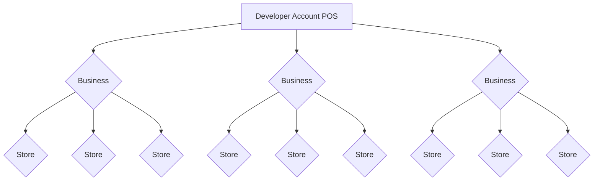
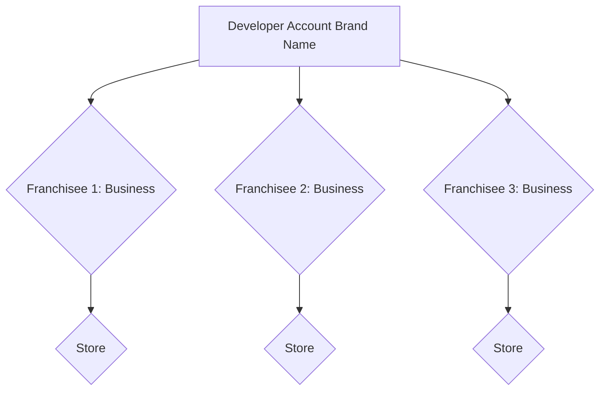
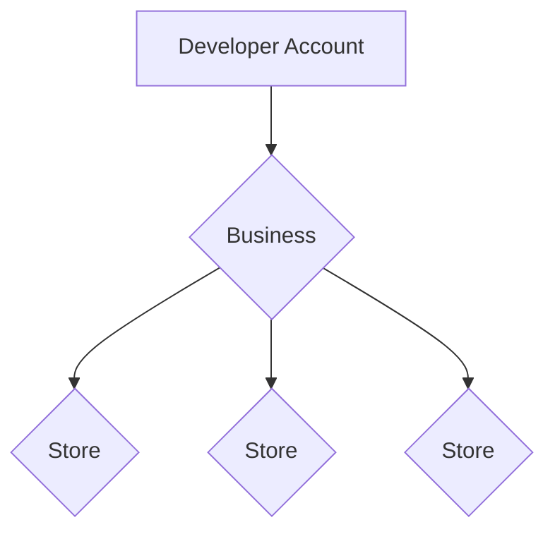

# How to Build for Restaurants

Drive API Production Access is Limited

<Warning>
Production access to the Drive API is currently restricted, and we cannot provide a timeline for certification following development. If you have not completed development and submitted a production access request, we recommend pausing development. Contact us [here](https://docs.google.com/forms/d/e/1FAIpQLSfggU_NjGWCdi9vyWUicrnzJmtu9vC4zgbfSC3ROwSvW4eV2g/viewform) to record your interest.
</Warning>

[DoorDash Drive](https://developer.doordash.com/en-US/docs/drive/overview/about_drive/) enables you to use DoorDash's on-demand logistics platform and fleet of Dashers to deliver your goods quickly and easily, without the hassle of staffing your own delivery fleet. Whether you need flexible fulfillment for overflow or a consistent on-demand delivery service, our platform is designed to work with your business.

This document covers **how to integrate with DoorDash Drive for restaurants** including:

* Online ordering platforms
* Point of sales (POS) systems
* Marketplaces
* Order management platforms
* Restaurant websites and apps

## 1. Prerequisites[​](#1-prerequisites "Direct link to heading")

1. **Get started by [creating a Developer Portal account](https://developer.doordash.com/en-US/docs/drive/tutorials/get_started/#sign-into-the-developer-portal).** The Developer Portal is the tool you'll use to build and manage your DoorDash Drive integration. You can also [add other members](https://developer.doordash.com/en-US/docs/drive/how_to/add_members/) to your organization and assign permissions for each user based on your organization's needs.
   * If your organization does business in multiple countries, you will need to create a unique Developer Portal account per country.

2. **After logging into the Developer Portal, you will need to [create credentials](https://developer.doordash.com/en-US/docs/drive/how_to/manage_credentials) and [authenticate to the API](https://developer.doordash.com/en-US/docs/drive/how_to/JWTs).** Check out our JSON Web Token (JWT) [resources](https://developer.doordash.com/en-US/blog/doordash-drive-jwt-resources) to help you generate a JWT and communicate securely with DoorDash.

3. **Feel free to use one of our tutorials,** which will walk you through getting the credentials you need to call the APIs and making some basic API calls.
   * [Get started via API](https://developer.doordash.com/en-US/docs/drive/tutorials/get_started): This tutorial references different coding languages including Python, PHP, Java, Kotlin, and C#.
   * If you're writing an app in Node.js (using JavaScript or TypeScript), [get started using our Node.js SDK](https://developer.doordash.com/en-US/docs/drive/tutorials/get_started_sdk)
   * If you'd like to try our APIs interactively, [get started using our Postman collection](https://developer.doordash.com/en-US/docs/drive/tutorials/get_started_postman)

## 2. Develop your Integration[​](#2-develop-your-integration "Direct link to heading")

**Key Points:**

* If your organization has more than one store location, creating businesses and stores via the [Business and Store APIs](https://developer.doordash.com/en-US/api/drive#tag/Business-and-Store) is required.
  + Each Developer Portal account should only contain businesses and stores in a single country.
* [Calling the Create Quote API](https://developer.doordash.com/en-US/docs/drive/how_to/quote_deliveries/) is recommended because it allows for the validation of coverage, pricing, and dropoff details before formally creating the delivery.
  + Quotes are valid for 5 minutes.
* [Accept Quote API](https://developer.doordash.com/en-US/api/drive/#tag/Delivery/operation/DeliveryQuoteAccept): Call the Accept Quote API within 5 minutes of creating the quote to formally create the delivery.
  + Only two fields can be edited when accepting the quote: tip and dropoff\_phone number.
  + It is recommended to process the customer's payment before accepting the quote.
* [Creating a delivery](https://developer.doordash.com/en-US/api/drive#tag/Delivery/operation/CreateDelivery) without first creating a quote is generally not recommended because there is no opportunity to validate coverage, timing, customer payment, or dropoff details.
* If DoorDash returns an error, this should be surfaced to the end user to fix the information (if necessary)
* Full list of error reasons [here](https://developer.doordash.com/en-US/docs/drive/reference/errors/)
* It is recommended to ingest [webhooks](https://developer.doordash.com/en-US/docs/drive/how_to/webhooks/) to receive status updates on deliveries in progress
* DoorDash requires specific information to be sent to customers including the tracking URL, latest delivery status, order dropoff time, order ID, and restaurant phone number
* DoorDash requires the following to be sent to restaurants: delivery ID, external\_delivery\_id, pickup\_time/dropoff\_time, and items in the order
* A restaurant is required to have a workflow to handle cancellations and there are 3 ways to cancel an order:
  + [Cancellations API](https://developer.doordash.com/en-US/api/drive#tag/Delivery/operation/CancelDelivery)
    - **Cannot** be used after a Dasher has been assigned
  + Merchant Portal
  + [DoorDash Support](https://developer.doordash.com/en-US/docs/drive/support#get-in-touch-with-us)

### A) Onboarding[​](#a-onboarding "Direct link to heading")

DoorDash Drive maintains a data model of [businesses and stores](https://developer.doordash.com/en-US/docs/drive/reference/businesses_and_stores/). A **business** is a merchant that owns a collection of stores usually under the same brand name—typically a corporation, franchise, or LLC. A **store** is an individual location from which deliveries are made. Some examples of different stores/businesses include:

#### Example A: POS Model with Different Businesses[​](#example-a-pos-model-with-different-businesses "Direct link to heading")

##### One merchant with multiple businesses and stores under one online ordering/point of sales system.[​](#one-merchant-with-multiple-businesses-and-stores-under-one-online-orderingpoint-of-sales-system "Direct link to heading")

#### Example B: Franchisee Model[​](#example-b-franchisee-model "Direct link to heading")

##### A restaurant with different store locations and a unique billing entity associated with each store.[​](#a-restaurant-with-different-store-locations-and-a-unique-billing-entity-associated-with-each-store "Direct link to heading")

#### Example C: Business with Multiple Store Locations[​](#example-c-business-with-multiple-store-locations "Direct link to heading")

##### One business with multiple store locations.[​](#one-business-with-multiple-store-locations "Direct link to heading")

**If your organization has more than one store location, creating businesses and stores via the [Business and Store APIs](https://developer.doordash.com/en-US/api/drive#tag/Business-and-Store) is required.**

Onboarding businesses and stores via the API allows for improved delivery quality, clearer invoices, better support experiences, and access to additional delivery capabilities like alcohol, catering, and cash on delivery. It also helps simplify your API requests by abstracting common information, like a restaurant's pickup address and contact details, into a single ID that you can reference when creating a quote or delivery. [We make it easy to develop to our Business and Store API here.](https://developer.doordash.com/en-US/docs/drive/how_to/use_businesses_and_stores_api/)

**Note that each Developer Portal account should only contain businesses and stores in a single country.** If your organization does business in multiple countries, you will need to create a unique Developer Portal account per country. If you're having trouble testing deliveries outside of the US, you can [get in touch with our support team.](https://developer.doordash.com/portal/support)

### B) Getting a Quote[​](#b-getting-a-quote "Direct link to heading")

The [Create Quote API](https://developer.doordash.com/en-US/api/drive#tag/Delivery/operation/DeliveryQuote) allows you to [validate coverage and pricing](https://developer.doordash.com/en-US/docs/drive/how_to/quote_deliveries/) before formally creating a delivery and should be the first API call in a standard restaurant online ordering flow.

**Creating a quote is strongly recommended because it allows for the validation of pickup and dropoff details, giving the end user an opportunity to correct any missing or incorrect information before creating the delivery.** It also allows restaurants to confirm driver availability and delivery cost upfront, reducing the likelihood of order cancellations and refunds if DoorDash cannot fulfill the delivery.

For organizations with a customer-facing online ordering flow, such as online ordering platforms and restaurant websites/apps, it is most common to call the Create Quote API when the customer has built their cart and is ready to begin the checkout process. This is because the pickup and dropoff details (timing, addresses, customer name, order value) are required to get a quote. See the flowchart [here](https://developer.doordash.com/en-US/docs/drive/how_to/quote_deliveries) for more details.

For organizations with no customer-facing checkout UI, such as POS and order management systems, it is acceptable to get a quote after the customer has already placed their order. Typically this flow depends on manual actions taken by an operator at the restaurant, who is deciding whether a given order should be fulfilled by DoorDash Drive.

**Quotes are valid for 5 minutes.** It is recommended to automatically send a new Create Quote API call with the same details every 5 minutes to account for situations where the customer or restaurant operator may take longer than 5 minutes to complete checkout or assign the delivery to DoorDash.

### C) Accepting a Quote[​](#c-accepting-a-quote "Direct link to heading")

If the pricing and timing returned in the quote response are acceptable, you should call the [Accept Delivery Quote API](https://developer.doordash.com/en-US/api/drive/#tag/Delivery/operation/DeliveryQuoteAccept) to formally create the delivery. **Quotes must be accepted within 5 minutes of quote creation.**

A few other important items to note:

* In a standard restaurant online ordering flow, this is usually done at the point that the customer completes checkout.
* **It is recommended to process the customer's payment before accepting the quote.** If the customer's payment fails and the delivery is not immediately canceled via API, a Dasher will be dispatched to the restaurant even though the order was not successfully placed and the restaurant will be charged a delivery fee.
* **There are only 2 fields that can be edited when accepting the quote: the tip and dropoff\_phone\_number.** This is because customers typically add their contact details and tip toward the end of the checkout process.

Alternatively to the create/accept quote model, a restaurant can also send a [Create Delivery API](https://developer.doordash.com/en-US/api/drive#tag/Delivery/operation/CreateDelivery) call directly without first creating a quote. This is generally not recommended because there is no opportunity to validate coverage, timing, customer payment, or validity of the delivery information before creating the delivery. This can result in potential errors, cancellations, and refunds, as well as a negative user experience for the customer.

### D) Important Fields[​](#d-important-fields "Direct link to heading")

See below for important fields for the restaurant use case. Required fields are necessary for production access. Recommended fields are encouraged to provide a best-in-class delivery experience, but are not needed for production access. Fields not listed in this section are not recommended for the restaurant use case and should not be included in payloads unless otherwise discussed with the DoorDash team.

#### Required / Recommended Fields for All Deliveries[​](#required--recommended-fields-for-all-deliveries "Direct link to heading")

| Field Name | Description | Required or Recommended? | Why is this field important? |
| --- | --- | --- | --- |
| external\_delivery\_id | Unique identifier for the delivery | **Required** | Required to differentiate between deliveries |
| pickup\_external\_business\_id | Unique business identifier previously created via the Business + Store APIs; must be used in combination with pickup\_external\_store\_id to select the pickup location | **Required** if your organization has >1 store location | Required for improved delivery quality, clearer invoices, better support experiences, and access to additional delivery capabilities like alcohol, etc. |
| pickup\_external\_store\_id | Unique store identifier previously created via the Business + Store APIs; must be used in combination with pickup\_external\_business\_id. If this field is used, the address associated with the store ID will override the pickup\_address in the request. | **Required** if your organization has >1 store location | Required for improved delivery quality, clearer invoices, better support experiences, and access to additional delivery capabilities like alcohol, etc. |
| pickup\_address | Address where order should be picked up. This address is overridden by store properties if pickup\_external\_store\_id and pickup\_external\_business\_id are used. | **Required** for single location organizations where pickup\_external\_store\_id and pickup\_external\_business\_id are not used | Required so the Dasher knows the where to pick up the order |
| pickup\_phone\_number | Store phone number. Must include the country code that matches the country where the delivery is taking place. This number is overridden by store properties if pickup\_external\_store\_id and pickup\_external\_business\_id are used. | **Required** if phone number is not included when creating the store via the Business + Store APIs, or for single location organizations where pickup\_external\_store\_id and pickup\_external\_business\_id are not used | Required so the Dasher and/or DoorDash Support can call the restaurant if there are any issues during the delivery |
| dropoff\_address | Address where order should be delivered | **Required** | Required so the Dasher knows where to dropoff the order |
| dropoff\_address\_components | Address where order should be delivered, broken into individual components (i.e. street address, subpremise, city, state, zip, country) | **Required** | Required so the Dasher knows where to dropoff the order (should be passed along with string address in order to allow for better address resolution and delivery quality) |
| dropoff\_contact\_given\_name | Customer first name | **Required** | Required so the Dasher knows which order to pick up at the restaurant, and so the DoorDash support team can get in contact with the customer if necessary |
| dropoff\_phone\_number | Customer phone number, including the country code | **Required** | Required so the Dasher can call the customer if there are any issues with the delivery |
| pickup\_time **OR** dropoff\_time | The UTC date-time (in ISO-8601 format) when the order should be picked up or dropped off. **Only one or the other should be included in the request, not both.** Pickup\_time is generally recommended for on-demand restaurant deliveries where the restaurant requires a certain amount of prep time for each order. Dropoff\_time is recommended in cases where the delivery is being scheduled >1 hour in advance. If neither field is passed, DoorDash will treat the delivery as ASAP and send the first available Dasher. | **Required** if customer can schedule a delivery time | Required to ensure a smooth delivery experience for both the merchant and the customer |
| tip | Dasher tip, in cents | Recommended | Recommended for quicker Dasher assignment (note DoorDash can provide a discount on the delivery fee if tips are passed; 100% of tips collected from the customer must be passed in full to DoorDash) |
| order\_value | Order subtotal, excluding tax, tips, and fees | Recommended | Recommended for refunds in the event that the delivery is unsuccessful |
| pickup\_business\_name | Name of pickup location, usually a restaurant or store. This name is overridden by store properties if pickup\_external\_store\_id and pickup\_external\_business\_id are used. | Recommended | Helps the Dasher find the correct pickup location and is included in SMS notifications to the customer |
| pickup\_instructions | Basic instructions to help the Dasher during the pickup process, e.g. "enter through side door." | Recommended | Allows for smoother pickup experience |
| dropoff\_instructions | Basic instructions to help the Dasher during the dropoff process, e.g. "buzz #1234." Do not include prompts for contactless deliveries in this field. | Recommended | Allows for smoother delivery experience |
| contactless\_dropoff | Allows the Dasher to leave the order at the customer's door, prompting them to take a photo upon dropoff. Cannot be true for restricted item deliveries like alcohol. | Recommended | Recommended for customers to have the option of a contactless delivery in the UI and sent to DoorDash, which leads to less Never Delivered/Cancellations if the customer is unable to take the delivery at that time |
| items | List of items included in the delivery | Recommended for all deliveries; required for organizations delivering restricted items | Required for all organizations delivering restricted items per DoorDash Policy; also allows for better support experiences in the case of missing/incorrect items |

#### Required / Recommended Fields for Restricted Item Deliveries (Alcohol)[​](#required--recommended-fields-for-restricted-item-deliveries-alcohol "Direct link to heading")

| Field Name | Description | Required or Recommended? | Why is this field important? |
| --- | --- | --- | --- |
| items | List of items included in the delivery; must include restricted items | **Required** | Required for all restricted item deliveries per DoorDash Policy |
| order\_contains | Specifies the restricted item(s) contained in the order | **Required** | Required for all restricted item deliveries per DoorDash Policy |
| action\_if\_undeliverable | Must be specified as "return\_to\_pickup," allowing the Dasher to return the items to the store if the delivery is unsuccessful | **Required** | Required for all restricted item deliveries per DoorDash Policy (note there is a return fee associated with returns) |

#### Required / Recommended Fields for Catering & Large Orders[​](#required--recommended-fields-for-catering--large-orders "Direct link to heading")

| Field Name | Description | Required or Recommended? | Why is this field important? |
| --- | --- | --- | --- |
| order\_fulfillment\_method | Specifies the type of delivery, e.g. large order | **Required** for large order fulfillment/catering orders | Required to ensure that orders intended to be fulfilled through DoorDash's large order fulfillment service are handled appropriately |
| dropoff\_options | Catering\_setup field specifies if the delivery requires the Dasher to complete catering setup | Recommended for large order fulfillment/catering orders | Recommended if catering setup is needed |

### E) Error Handling[​](#e-error-handling "Direct link to heading")

When calling the Create Quote, Accept Quote, or Create Delivery APIs, DoorDash may return an error code for various reasons. Each API call is associated with a specific status:

* 2xx: succeeded
* 4xx: failed
* 5xx: errored

Some example error codes are: "Duplicate delivery ID", "Allowed distance between addresses exceeded", or "Validation Failed." Reference the [Error Codes and Reasons page](https://developer.doordash.com/en-US/docs/drive/reference/errors/) for a full list of error reasons.

It is required to have a clear feedback loop and workflow when DoorDash rejects an API call. Errors at the Create Quote stage should be shown to end users and they should be prompted to fix any issues with the delivery. After fixing the errors, a new Create Quote call should be generated to validate the information. Errors at the Accept Quote or Create Delivery stage should inform the customer that the delivery order cannot be completed.

For example, if DoorDash sends a "Phone Number provided does not seem to be valid" error, the end user should be prompted to edit their phone number and send a new Create Quote call. Or if the error is "Allowed distance between addresses exceeded", we recommend asking the end user to confirm their address and the store from which they are ordering from. Refer to the [best practice of retry strategy page](https://developer.doordash.com/en-US/docs/drive/reference/retry_pattern/) for general guidance on retry strategies.

### F) Delivery Management & Tracking[​](#f-delivery-management--tracking "Direct link to heading")

#### a) Webhooks and Get Delivery API[​](#a-webhooks-and-get-delivery-api "Direct link to heading")

A developer can receive updates about each specific delivery by subscribing to [webhooks](https://developer.doordash.com/en-US/docs/drive/how_to/webhooks/) from the Drive API. Webhooks provide real time updates to the customer about their order, as well as other events such as cancellations and returns. DoorDash strongly recommends integrating with webhooks to provide real time updates to the customer and ensure the best in class delivery experience. See the following documentation on webhooks:

* [Webhook reference](https://developer.doordash.com/en-US/docs/drive/reference/webhooks/): List of all event webhooks
* [Refund Webhooks](https://developer.doordash.com/en-US/docs/drive/reference/webhooks-refunds): Webhooks specific to refunds
* [Delivery Statuses](https://developer.doordash.com/en-US/docs/drive/reference/delivery_statuses): Supported states in the delivery lifecycle

A restaurant can also call the [Get Delivery API](https://developer.doordash.com/en-US/api/drive/#tag/Delivery/operation/GetDelivery) for the ​​status and details of a delivery. This can replace or be used in addition to webhook events.

#### b) What should be communicated to the customer?[​](#b-what-should-be-communicated-to-the-customer "Direct link to heading")

DoorDash **requires** restaurants to communicate the following delivery information to their customer:

* Tracking URL returned in the response payload/webhooks
* Latest delivery status returned in the webhooks or the Get Delivery Status response
* Order dropoff time
* Order ID
* Restaurant phone number

This information can be displayed via the confirmation screen, email, or any other surface that customers have access to within your product. This is not required if DoorDash SMS notifications are enabled.

[SMS notifications](https://developer.doordash.com/en-US/docs/drive_classic/how_to/configure_sms/) are enabled by default in the Developer Portal. It is recommended that a restaurant also sends the "Dropoff\_contact\_send\_notifications" field as "true" in request payload of the Create Quote/Create Delivery API calls.

If a restaurant is already communicating to the customer the above information, these configurations can be disabled in Developer Portal under the settings tab and by sending the "Dropoff\_contact\_send\_notifications" field as false.

#### c) What should be communicated to the restaurant?[​](#c-what-should-be-communicated-to-the-restaurant "Direct link to heading")

DoorDash **requires** developers to send the following information to the restaurant about each delivery:

* Delivery ID (support\_reference) must be exposed to the restaurant
  + This integer ID, included in our API responses, is required for all support inbounds, including Drive Merchant Support (for non-technical questions/issues related to deliveries, such as refunds) and Developer Support (for technical/API questions/issues related to deliveries).
* External\_delivery\_id
  + This allows the restaurant to have accurate information about the delivery in their system and can be used to help in any potential support escalations.
* Pickup time/Dropoff time
  + This allows the restaurant to know what time the delivery should be ready.
* Items
  + This gives the necessary information to the restaurant on what to prepare in the order.

**Recommended**

* The tracking URL returned in our response payload and webhooks
  + This gives the restaurants real time updates on the Dasher arriving at the pickup location.
* Latest delivery status (returned in webhooks or Get Delivery Status responses)
  + This gives restaurants real time updates on the Dasher arriving at the dropoff location and where the delivery is in the lifecycle.
* Customer name
  + This gives the restaurant the ability to label the order appropriately.
* Customer phone number
  + This gives the restaurant the ability to call the customer if there are any issues with their order.

### G) Canceling a Delivery[​](#g-canceling-a-delivery "Direct link to heading")

A restaurant must have a workflow in place to handle cancellations as part of their development (this will be discussed during the Integrations Demo). There are three ways to cancel an order:

1. [Cancellations API](https://developer.doordash.com/en-US/api/drive#tag/Delivery/operation/CancelDelivery): A restaurant can use this API to cancel a delivery until a Dasher has been assigned to an order. After a dasher has been assigned, a developer **cannot** cancel an order using the Cancellations API and must call DoorDash support.
2. Merchant Portal: Merchants who have access to the DoorDash Merchant Portal can cancel deliveries **before** a Dasher is assigned. This URL is unique for each developer.
3. [DoorDash Support](https://developer.doordash.com/en-US/docs/drive/support#get-in-touch-with-us): A restaurant can call DoorDash support to cancel a delivery any time during the delivery process.

## 3. Test your Integration[​](#3-test-your-integration "Direct link to heading")

A developer can use the [Delivery Simulator](https://developer.doordash.com/en-US/docs/drive/how_to/use_delivery_simulator/) in the Developer Portal to test their integration during and post development. Deliveries created in the Delivery Simulator are for testing purposes and therefore not dispatched to real dashers. The delivery simulator allows a developer to easily create new test deliveries and update the state of each. After each state change, the status of the delivery should reflect the state in the API response and send different webhook events. This state of the delivery will also show in the [Get Delivery API](https://developer.doordash.com/en-US/api/drive/#tag/Delivery/operation/GetDelivery) call.

### A) Validation Checklist prior to requesting a Demo[​](#a-validation-checklist-prior-to-requesting-a-demo "Direct link to heading")

In addition to using the Delivery Simulator, it is recommended for a developer to test scenarios in the Validation Checklist below prior to requesting a Developer Demo with DoorDash. This validation checklist includes different test scenarios DoorDash will run through on the demo and accelerate the certification process.

#### Validation Checklist: Test Scripts[​](#validation-checklist-test-scripts "Direct link to heading")

| Scenario | Steps | Expected Results | API Calls vs Delivery Simulator | Reference Documentation |
| --- | --- | --- | --- | --- |
| Create Quote | Submit a create quote call to DooorDash from your integration | Response received as successful | API Call | [Create Quote API](https://developer.doordash.com/en-US/api/drive/#tag/Delivery/operation/DeliveryQuote) |
| Accept Quote/Create Delivery | Submit a accept quote/create delivery call to DooorDash from your integration | Response received as successful | API Call | [Accept Quote API](https://developer.doordash.com/en-US/api/drive/#tag/Delivery/operation/DeliveryQuoteAccept) [Create Delivery API](https://developer.doordash.com/en-US/api/drive/#tag/Delivery/operation/CreateDelivery) |
| Webhooks | Create a delivery and use delivery simulator to proceed to next steps. DoorDash delivery created --> Dasher picks up --> Order dropped off. Are you ingesting webhooks successfully? | Received the following webhooks: dasher\_confirmed, dasher\_enroute\_to\_pickup, dasher\_confirmed\_pickup\_arrival, dasher\_picked\_up, dasher\_enroute\_to\_dropoff, dasher\_confirmed\_dropoff\_arrival, dasher\_dropped\_off | Delivery Simulator | [Webhooks](https://developer.doordash.com/en-US/docs/drive/reference/webhooks/) |
| Cancellation API (if applicable) | Developer sends Cancel API (likely for a scheduled order). Is it successfully created? | Confirm the delivery is successfully cancelled. Received the delivery\_cancelled webhook | API Call | [Cancellation API](https://developer.doordash.com/en-US/api/drive/#tag/Delivery/operation/UpdateDelivery) |
| DoorDash returns an error during Create Quote/Create Delivery | Submit a create quote call to DooorDash from your integration. DoorDash returns an error | Error is surfaced to the customer to fix the issue and resubmit a delivery | API Call | [Error codes and reasons](https://developer.doordash.com/en-US/docs/drive_classic/reference/errors/) |
| DoorDash cancels the delivery | Submit a create quote call to DooorDash from your integration. Submit a accept quote/create delivery call to DooorDash from your integration. DoorDash cancels delivery | Customer is informed of the cancellation via either DoorDash SMS configurations or the Merchant informs them | Delivery Simulator | [SMS delivery updates](https://developer.doordash.com/en-US/docs/drive_classic/how_to/configure_sms/) |

Based on common issues we've seen, please confirm the following before requesting a demo:

* Fields with time ("Pickup\_time"/"Dropoff\_time"/"Pickup\_window"/"Dropoff\_window") must be in **UTC**
* If you are collecting tip through the interface, pass the tip field with that amount in the Create Quote/Accept Quote/Create Delivery API call
* If DoorDash responds with an error, surface the error to the customer and ask them to re-validate the information to submit another Create Quote/Create Delivery API call

## 4. Get Production Access: Demo process and Launch[​](#4-get-production-access-demo-process-and-launch "Direct link to heading")

We recommend completing the following before requesting production access:

* Review and fill the Validation Checklist above
* Review the checklist on the [Integrations Requirements page](https://developer.doordash.com/en-US/docs/drive/overview/integration_requirements/#before-you-request-production-access)

[See how to get production access here.](https://developer.doordash.com/en-US/docs/drive/how_to/get_production_access/#1-request-production-access-via-the-developer-portal)

## 5. Maintain and grow your integration[​](#5-maintain-and-grow-your-integration "Direct link to heading")

### A) Support/Health of Integration[​](#a-supporthealth-of-integration "Direct link to heading")

There are separate [support channels](https://developer.doordash.com/en-US/docs/drive/support/) for different types of support inquiries, including business-related queries, delivery/dasher-related issues, live delivery in progress, past deliveries, developer portal/integrations questions, billing/invoicing support, and outages.

There are two ways to [monitor integration health](https://developer.doordash.com/en-US/blog/#monitor-the-health-of-your-integration-with-new-dashboards):

* Developer Portal Dashboard
  + The dashboard shows you up-to-the-minute status and a historical view of API requests (from you to DoorDash) and webhooks (from DoorDash to you). You can use these dashboards to see, in real-time, if something is wrong between DoorDash and your systems. You can check your dashboard in the Developer Portal under the Overview tab.
* [Health Alerts](https://developer.doordash.com/en-US/docs/drive/reference/understand_elevated_error_emails/)
  + With DoorDash Drive, you will receive anomaly alerts to identify errors occuring with your integration. These alerts are sent to all users on the developer portal with guidance on the error type, developer name, and threshold of failures reached.

### B) Grow your business with Drive[​](#b-grow-your-business-with-drive "Direct link to heading")

There are other features a restaurant can enable to further grow their business on Drive, including:

* [Deliver catering and other large orders](https://developer.doordash.com/en-US/docs/drive/how_to/deliver_large_orders/)
* [Deliver cash orders](https://developer.doordash.com/en-US/docs/drive/how_to/deliver_cash_orders/)
* [Enable Alcohol deliveries](https://developer.doordash.com/en-US/docs/drive/how_to/deliver_alcohol/)

