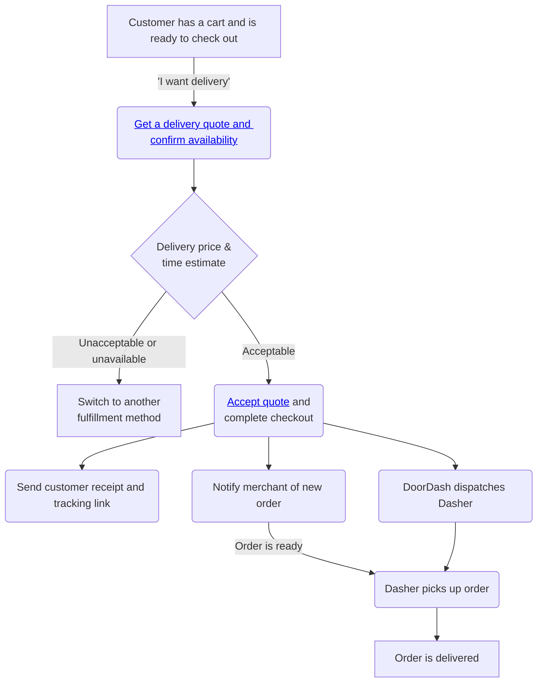

# Validate coverage & pricing: quotes

API: Drive

If you’re building for restaurants, see the [How to Build for Restaurants Guide](https://developer.doordash.com/en-US/docs/drive/how_to/build_for_restaurants/).

You can use one of two workflows when creating deliveries using DoorDash Drive:

1. You can call the [Create Delivery API](/en-US/api/drive/#operation/CreateDelivery) directly, without first requesting a delivery quote
2. You can call the [Delivery Quote API](/en-US/api/drive/#operation/DeliveryQuote) and [Accept Delivery Quote API](/en-US/api/drive/#operation/DeliveryQuoteAccept)

We recommend using the second workflow because it allows you to confirm that a delivery is servicable and get back a price that you can show to the customer as part of a checkout process. See [Getting a Quote](https://developer.doordash.com/en-US/docs/drive/how_to/build_for_restaurants/#b-getting-a-quote) in the [How to Build for Restaurants guide](https://developer.doordash.com/en-US/docs/drive/how_to/build_for_restaurants/) for more details.

## The quote workflow[​](#the-quote-workflow "Direct link to heading")



## 1. Prerequisites[​](#1-prerequisites "Direct link to heading")

If you're new to Drive and haven't yet created your first delivery, you should start with one of our tutorials. The tutorials will walk you through getting the credentials you need to call the APIs and making some basic API calls.

* [Get started by making API calls](/en-US/docs/drive/tutorials/get_started)
* If you're writing an app in Node.js (using JavaScript or TypeScript), [get started using our Node.js SDK](/en-US/docs/drive/tutorials/get_started_sdk)
* If you'd like to try our APIs interactively, [get started using our Postman collection](/en-US/docs/drive/tutorials/get_started_postman)

## 2. Get a quote[​](#2-get-a-quote "Direct link to heading")

Before you create a delivery, you can request a quote using the [Delivery Quote API](/en-US/api/drive/#operation/DeliveryQuote). When you request a quote, you provide the pickup and dropoff addresses and DoorDash will confirm that the addresses are in a serviceable area, calculate the delivery fee, and estimate the times for the order to be picked up and dropped off. You'll receive a response with the time estimates, the fees, and other delivery details:

> POST `/drive/v2/quotes`

```
{  
    ... (other delivery details)  
    "delivery_status": "quote",  
    "pickup_time_estimated": "2018-08-22T17:20:28Z",  
    "dropoff_time_estimated": "2018-08-22T17:20:28Z",  
    "currency": "USD",  
    "fee": 1900,  
    ...  
}  

```

## 3. Accept a quote[​](#3-accept-a-quote "Direct link to heading")

If the fee and time ranges are acceptable, you accept the quote using the [Accept Delivery Quote API](/en-US/api/drive/#operation/DeliveryQuoteAccept). You must accept a quote within **5 minutes** of requesting it.

You can edit the `tip` field as part of accepting a quote. Just pass it in the body of the request:

> POST `/drive/v2/quotes/{external_delivery_id}/accept`

```
{  
    "tip": "600"  
}  

```

You'll receive a response with an updated delivery status and a tracking URL, among other data:

```
{  
    ... (other delivery details)  
    "delivery_status": "created",  
    "tracking_url": "https://doordash.com/tracking?id=...",  
    ...  
}  

```

